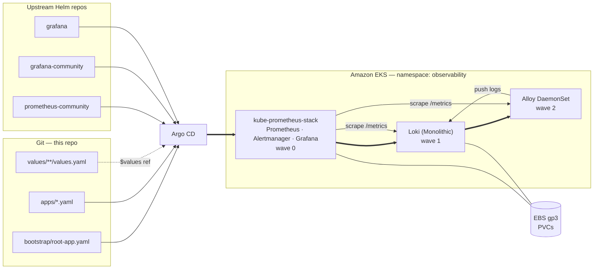

# Argo CD Observability — kube-prometheus-stack + Loki on EKS

> Deploy a full metrics-and-logs stack to EKS declaratively: Argo CD pulls two
> upstream Helm charts and your own values files from git, in the right order,
> with nothing applied by hand except a single bootstrap manifest.




## What you'll learn

- The **app-of-apps** pattern: one root Application that manages all the others
- **Multi-source Applications**: an upstream Helm chart + your git-hosted values
- **Sync waves** for ordering operator → Loki → log shipper
- Why kube-prometheus-stack needs **ServerSideApply**
- The EKS-specific settings that stop four alerts firing forever on day one
- Loki on local disk for a POC, and the one-values-file path to S3 later

## Prerequisites

| Requirement | Note |
|---|---|
| EKS cluster, Kubernetes ≥ 1.25 | kube-prometheus-stack 90.x requires it |
| Argo CD ≥ 2.6 in namespace `argocd` | multi-source needs 2.6+ |
| EBS CSI driver add-on | for the Prometheus/Grafana/Loki PVCs |
| `kubectl`, and `eksctl` ≥ 0.181 for Phase 2 | |
| A fork of this repo | you will edit values files and push |
| **2 worker nodes, ≥ 4 vCPU / 8 GiB total** | `t3.medium` × 2. See below — this is the one prerequisite people skip |

### Sizing

A full stack on an undersized cluster fails in confusing ways, so be concrete:

- **Single-node clusters do not work.** Prometheus scheduling and resharding
  fail, and Loki compaction gets unstable.
- **`t3.small` is too small** — Prometheus gets OOM-killed during startup.
- `t3.medium` × 2 (4 vCPU / 8 GiB total) reliably runs Prometheus,
  Alertmanager, Grafana, Loki and Alloy together, with headroom for
  compaction bursts and interactive Grafana use.

Requests in these values total roughly 1.5 vCPU and 4 GiB, so that baseline is
comfortable rather than tight. Real capacity planning depends on your log
volume, retention and scrape frequency — this is a floor, not a sizing guide.

*(Baseline validated by [LaurisNeimanis/gitops-observability-stack](https://github.com/LaurisNeimanis/gitops-observability-stack).)*

---

## Step 1 — Fork and set your repo URL

Every `repoURL` pointing at git in `gitops/` must be **your** fork.

```bash
git clone https://github.com/<you>/aws-mini-lessons.git
cd aws-mini-lessons

grep -rl 'BoldFellow/aws-mini-lessons' argocd-observability/gitops \
  | xargs sed -i 's|BoldFellow/aws-mini-lessons|<you>/aws-mini-lessons|g'
```

If the repo is private, register it with Argo CD first:

```bash
argocd repo add https://github.com/<you>/aws-mini-lessons.git \
  --username <user> --password <PAT>
```

## Step 2 — Create a gp3 StorageClass

EKS ships `gp2` as default. `gp3` is ~20% cheaper and lets you buy IOPS
independently of size — always prefer it for Prometheus.

```bash
cat <<'EOF' | kubectl apply -f -
apiVersion: storage.k8s.io/v1
kind: StorageClass
metadata:
  name: gp3
  annotations:
    storageclass.kubernetes.io/is-default-class: "true"
provisioner: ebs.csi.aws.com
volumeBindingMode: WaitForFirstConsumer
allowVolumeExpansion: true
parameters:
  type: gp3
  encrypted: "true"
EOF

# Remove the default flag from gp2 so only one default exists
kubectl patch storageclass gp2 -p \
  '{"metadata":{"annotations":{"storageclass.kubernetes.io/is-default-class":"false"}}}'
```

## Step 3 — Grafana admin credentials

Never commit these. Create the secret out of band:

```bash
kubectl create namespace observability --dry-run=client -o yaml | kubectl apply -f -

kubectl -n observability create secret generic grafana-admin \
  --from-literal=admin-user=admin \
  --from-literal=admin-password="$(openssl rand -base64 24)"
```

This is the one non-reproducible step, and deliberately so: the *value* must not
be in git. For real clusters, keep it in AWS Secrets Manager and pull it in with
External Secrets Operator —
[`gitops/examples/external-secret-grafana-admin.yaml`](gitops/examples/external-secret-grafana-admin.yaml)
is the manifest that replaces this command. ESO itself is not installed here:
it is a chart plus its own IAM role.

## Step 4 — Commit and bootstrap

```bash
git add argocd-observability && git commit -m "observability stack" && git push

kubectl apply -f argocd-observability/gitops/projects/bootstrap.yaml
kubectl apply -f argocd-observability/gitops/projects/observability.yaml
kubectl apply -f argocd-observability/gitops/bootstrap/root-app.yaml
```

That is the last imperative command in this lesson. Watch it converge:

```bash
kubectl -n argocd get applications -w
```

Expected order (this is sync waves doing their job):

```
prometheus-operator-crds   Synced   Healthy    # wave -2
kube-prometheus-stack      Synced   Healthy    # wave  0
loki                       Synced   Healthy    # wave  1
alloy                      Synced   Healthy    # wave  2
```

## Step 5 — Verify

```bash
# Grafana
kubectl -n observability port-forward svc/kube-prometheus-stack-grafana 3000:80
# -> http://localhost:3000, user admin, password from Step 3

# Are logs actually arriving?
kubectl -n observability logs -l app.kubernetes.io/name=alloy --tail=50 | grep -i loki

# Are chunks being written?
kubectl -n observability exec sts/loki -- ls -R /var/loki/chunks | head
```

Then generate some traffic so there is definitely something to find:

```bash
kubectl apply -f argocd-observability/test/log-generator.yaml
```

In Grafana → **Explore** → datasource **Loki**:

```logql
{app="log-generator"} | json | status >= 400
```

`flog` writes fake JSON access logs to stdout; Alloy already tails every pod's
stdout, so no sidecar or shared volume is involved. If those lines appear, the
whole path works: kubelet wrote the file, Alloy read and parsed it, Loki stored
it, Grafana queried it. Delete it when you are done:

```bash
kubectl delete -f argocd-observability/test/log-generator.yaml
```

And in **Explore** → datasource **Prometheus**:

```promql
sum by (namespace) (rate(container_cpu_usage_seconds_total{image!=""}[5m]))
```

## Step 6 — Prove GitOps works

Change something small and push:

```bash
sed -i 's/retention: 15d/retention: 30d/' \
  argocd-observability/gitops/values/kube-prometheus-stack/values.yaml
git commit -am "prometheus: retain 30d" && git push
```

Within the reconcile interval (3 min by default; `argocd app sync` to force it)
Argo CD re-renders the chart with the new values and rolls the StatefulSet.
No `helm upgrade`, no CI job with cluster credentials.

Now try the opposite — break it by hand:

```bash
kubectl -n observability scale deploy/kube-prometheus-stack-grafana --replicas=0
```

`selfHeal: true` puts it back within seconds. **The cluster cannot drift from
git.** That is the whole point.

---

## Phase 2 — Moving Loki to S3

Everything above runs Loki on its PVC: no buckets, no IAM, works on any cluster.
That is the right place to start and the wrong place to stay — losing the PVC
loses the logs, and a node drain takes ingestion with it.

Moving to S3 is a values change, not a data migration, which is the reason to
start in Monolithic mode rather than filesystem-on-SimpleScalable. Do this once
someone other than you depends on the logs.

Create the buckets:

```bash
export AWS_REGION=eu-central-1
export CLUSTER=my-eks-cluster
export ACCOUNT_ID=$(aws sts get-caller-identity --query Account --output text)
export BUCKET_PREFIX="${ACCOUNT_ID}-loki"

for b in chunks ruler; do
  aws s3api create-bucket --bucket "${BUCKET_PREFIX}-${b}" \
    --region "$AWS_REGION" \
    --create-bucket-configuration LocationConstraint="$AWS_REGION"
  aws s3api put-public-access-block --bucket "${BUCKET_PREFIX}-${b}" \
    --public-access-block-configuration \
    "BlockPublicAcls=true,IgnorePublicAcls=true,BlockPublicPolicy=true,RestrictPublicBuckets=true"
  aws s3api put-bucket-encryption --bucket "${BUCKET_PREFIX}-${b}" \
    --server-side-encryption-configuration \
    '{"Rules":[{"ApplyServerSideEncryptionByDefault":{"SSEAlgorithm":"AES256"}}]}'

  # Reject any request that did not arrive over TLS. Encryption at rest above
  # says nothing about the wire; without this, a plain-HTTP PutObject succeeds.
  aws s3api put-bucket-policy --bucket "${BUCKET_PREFIX}-${b}" --policy "$(cat <<POLICY
{
  "Version": "2012-10-17",
  "Statement": [{
    "Sid": "DenyInsecureTransport",
    "Effect": "Deny",
    "Principal": "*",
    "Action": "s3:*",
    "Resource": [
      "arn:aws:s3:::${BUCKET_PREFIX}-${b}",
      "arn:aws:s3:::${BUCKET_PREFIX}-${b}/*"
    ],
    "Condition": { "Bool": { "aws:SecureTransport": "false" } }
  }]
}
POLICY
)"

  # Loki uploads chunks as multipart. An ingester killed mid-upload leaves parts
  # that are invisible to `s3 ls`, never expire, and are billed forever.
  aws s3api put-bucket-lifecycle-configuration --bucket "${BUCKET_PREFIX}-${b}" \
    --lifecycle-configuration '{"Rules":[{
      "ID":"abort-incomplete-multipart",
      "Status":"Enabled",
      "Filter":{},
      "AbortIncompleteMultipartUpload":{"DaysAfterInitiation":7}
    }]}'
done
```

> Retention is enforced by Loki's compactor, not by an S3 lifecycle rule on
> object age. Do not add one: it would delete chunks the index still references,
> and queries would fail rather than return less. The only lifecycle rule that
> is safe here is the multipart cleanup above.

Create the IAM policy (least privilege — only these two buckets):

```bash
cat > /tmp/loki-s3-policy.json <<EOF
{
  "Version": "2012-10-17",
  "Statement": [
    {
      "Sid": "ListTheTwoBuckets",
      "Effect": "Allow",
      "Action": ["s3:ListBucket", "s3:ListBucketMultipartUploads"],
      "Resource": [
        "arn:aws:s3:::${BUCKET_PREFIX}-chunks",
        "arn:aws:s3:::${BUCKET_PREFIX}-ruler"
      ]
    },
    {
      "Sid": "ObjectsInThoseBuckets",
      "Effect": "Allow",
      "Action": [
        "s3:GetObject",
        "s3:PutObject",
        "s3:DeleteObject",
        "s3:AbortMultipartUpload",
        "s3:ListMultipartUploadParts"
      ],
      "Resource": [
        "arn:aws:s3:::${BUCKET_PREFIX}-chunks/*",
        "arn:aws:s3:::${BUCKET_PREFIX}-ruler/*"
      ]
    }
  ]
}
EOF

aws iam create-policy --policy-name LokiS3Access \
  --policy-document file:///tmp/loki-s3-policy.json
```

Bind it to the `loki` ServiceAccount with **EKS Pod Identity**.

First install the agent. It is a DaemonSet that runs on every Linux EC2 node and
serves credentials to pods over a link-local address — without it, every AWS
call from every pod fails with a credentials error:

```bash
eksctl create addon --cluster "$CLUSTER" --name eks-pod-identity-agent
```

Then create the association. `eksctl` will create the role with the correct
trust policy and attach the permission policy in one step:

```bash
eksctl create podidentityassociation \
  --cluster "$CLUSTER" \
  --namespace observability \
  --service-account-name loki \
  --role-name loki-s3 \
  --permission-policy-arns "arn:aws:iam::${ACCOUNT_ID}:policy/LokiS3Access"
```

That is the whole binding. Note what is *absent*: no OIDC provider to associate,
no ServiceAccount annotation, and therefore no account ID anywhere in the git
repo. The mapping namespace + ServiceAccount → role lives in the EKS control
plane, so the same values file deploys unchanged into a different AWS account.

It also removes an ownership conflict that IRSA creates under GitOps: with IRSA
you must run `eksctl create iamserviceaccount --role-only`, because otherwise
`eksctl` and Argo CD both believe they own the `loki` ServiceAccount and fight
over it on every sync. Pod Identity never touches Kubernetes objects at all, so
the chart owns the ServiceAccount outright and there is nothing to reconcile.

If you build the role by hand instead, the trust policy is:

```json
{
  "Version": "2012-10-17",
  "Statement": [{
    "Effect": "Allow",
    "Principal": { "Service": "pods.eks.amazonaws.com" },
    "Action": ["sts:AssumeRole", "sts:TagSession"]
  }]
}
```

> `sts:TagSession` is required and is the usual reason a hand-rolled role fails.
> Pod Identity attaches session tags (cluster name, namespace, ServiceAccount)
> to the assumed session — those tags are what make ABAC possible, and the
> assume-role call is rejected without permission to set them.

Finally, swap the storage block in `gitops/values/loki/values.yaml` — this is
the entire application-side change. There is no role ARN to fill in; that is the
point of Pod Identity:

```yaml
loki:
  schemaConfig:
    configs:
      # Do NOT edit the existing filesystem entry — chunks already written are
      # still addressed by it. Append a new one with a future date instead.
      - from: "2024-04-01"
        store: tsdb
        object_store: filesystem
        schema: v13
        index: {prefix: index_, period: 24h}
      - from: "2026-10-01"          # a date that has not happened yet
        store: tsdb
        object_store: s3
        schema: v13
        index: {prefix: index_, period: 24h}

  storage:
    type: s3
    bucketNames:
      chunks: <ACCOUNT_ID>-loki-chunks
      ruler:  <ACCOUNT_ID>-loki-ruler
    s3:
      region: eu-central-1

  compactor:
    delete_request_store: s3

serviceAccount:
  create: true
  name: loki        # the Pod Identity association keys on this name
```

Old chunks stay readable through the first schema entry; new ones go to S3. You
can also shrink `singleBinary.persistence.size` back to ~20Gi afterwards, since
only the WAL and index cache remain local.

### Why Pod Identity rather than IRSA

| | IRSA | Pod Identity |
|---|---|---|
| Cluster prerequisite | OIDC provider per cluster | `eks-pod-identity-agent` add-on |
| Where the binding lives | annotation in your manifests | EKS control plane |
| Role reuse across clusters | one trust policy entry per cluster | one role, many clusters |
| Trust policy | OIDC federation with a `sub` condition string | four lines, no cluster-specific values |
| Role chaining / session tags | no | yes (enables ABAC) |
| Fargate, Windows nodes | works | **not supported** |

The trust-policy difference is the one that bites at scale: under IRSA the
policy embeds the cluster's OIDC issuer URL and the exact
`system:serviceaccount:<ns>:<sa>` subject, so a role cannot be shared across
clusters without editing it for each one. Pod Identity moves that mapping out of
IAM entirely.

> **The one case to stay on IRSA:** the agent is a DaemonSet, and Fargate does
> not run DaemonSets, so Pod Identity does not work on Fargate or on Windows
> nodes. Mixing is fully supported — Fargate workloads on IRSA, EC2 workloads on
> Pod Identity, same cluster. What you must not do is put **both** an
> `eks.amazonaws.com/role-arn` annotation and a Pod Identity association on the
> same ServiceAccount. The precedence is defined (Pod Identity wins) but nobody
> debugging at 2am remembers that.

---

## Design decisions worth defending in review

### CRDs are their own Application, in wave -2

The Prometheus CRDs are over 1 MB. Client-side apply writes a full copy of each
object into its `kubectl.kubernetes.io/last-applied-configuration` annotation
and hits the 262144-byte limit — the classic `metadata.annotations: Too long`
failure. `ServerSideApply=true` doesn't use that annotation at all, and is not
optional here.

Splitting them out also fixes a Helm limitation: charts do not upgrade CRDs in
their `crds/` directory, so as a separate chart a CRD bump is an ordinary sync.
`crds.enabled: false` in the stack's values prevents double ownership, and
`prune: false` on the CRD app means a mis-sync can never cascade-delete every
`ServiceMonitor` in the cluster.

### Two AppProjects

`default` permits any repo, any namespace, any kind — and Argo CD usually runs
as cluster-admin. `observability` names four repos and two namespaces. The root
app gets a narrower `bootstrap` project that can create nothing but
`argoproj.io/Application` in `argocd`, so a bad commit under `apps/` cannot
render into a Deployment or a ClusterRole.

### Four EKS components are disabled

`kubeControllerManager`, `kubeScheduler`, `kubeEtcd` and `kubeProxy` all default
to enabled and all assume a self-managed control plane. On EKS those endpoints
do not exist, so you get four permanently-firing `TargetDown` alerts and the
matching `defaultRules` groups alert on data that will never arrive. Turning off
both the exporters *and* their rule groups is the fix.

(`kubeProxy` is recoverable: patch the `kube-proxy` ConfigMap to
`metricsBindAddress: 0.0.0.0:10249` and re-enable it.)

### `serviceMonitorSelectorNilUsesHelmValues: false`

Default behaviour is that Prometheus only discovers `ServiceMonitor`s carrying
this Helm release's labels — so Loki's and Alloy's are invisible. This one line
is why "I installed the stack and my app's ServiceMonitor does nothing" is the
most-asked kube-prometheus-stack question.

### `ignoreDifferences` on the admission webhooks

The operator injects a CA bundle into its webhook configurations at runtime.
Argo CD sees a field it did not put there and reports `OutOfSync`; `selfHeal`
strips it; the operator re-adds it. Without `ignoreDifferences` you get an
infinite sync loop. `RespectIgnoreDifferences=true` is required for those
exclusions to also apply under server-side apply.

### Loki: Monolithic first, S3 second

Grafana documents two modes to actually target, and one to avoid:

| Mode | When | Object storage |
|---|---|---|
| **Monolithic** (was `SingleBinary`) | "a small meta monitoring stack" — and anything you're still learning | optional |
| **Microservices** (`Distributed`) | the official recommendation for production HA; how Grafana runs it internally | required |
| SimpleScalable | **deprecated, removed in Loki 4** — do not start here | required |

Note the middle rung is going away. The old advice was Monolithic → SimpleScalable
→ Distributed; the current advice is Monolithic for small, Microservices for
production, and skip SSD entirely.

Monolithic is also the only mode that runs without object storage, which is what
makes the POC above a single values file — and moving it to S3 later is a values
change, not a migration.

Two settings the official monolithic example sets that the chart does not:
`loki.pattern_ingester.enabled: true` (powers pattern detection in Grafana's
Explore Logs) and `loki.limits_config.allow_structured_metadata: true`
(high-cardinality fields per log line without a stream per value). Both are in
the values file.

The docs also zero out `read`/`write`/`backend` and the ten distributed
component replica counts. That is defensive: those templates are guarded on
`loki.deployment.isScalable` and `isDistributed`, both false in Monolithic mode,
so they never render either way. Left out here.

Two settings people forget:

- `loki.schemaConfig` is empty by default and a real install **requires** it.
  Use `tsdb` + `v13`. Never edit an existing schema entry — chunks already
  written are addressed by it. Append a new one with a future `from` date.
- `retention_period` in `limits_config` does nothing unless the compactor is
  told to enforce it (`compactor.retention_enabled: true`). Otherwise old data
  is hidden from queries while the disk (or the bill) keeps growing.

The chart's memcached caches (`chunksCache`, `resultsCache`) default to on and
request several GB each. Correct at scale, but on a small cluster they simply
never schedule — hence disabled.

### Alloy, not Promtail

Promtail reached **end-of-life on 2 March 2026**. Grafana Alloy is the
supported replacement; `alloy convert --source-format=promtail` migrates an
existing config. The deprecated `loki-stack` chart (2.10.3) bundles Promtail —
avoid it for anything new.

Keep the Loki label set small. Every distinct label-value combination is a
separate stream; `pod` is already borderline and `pod_uid` or `trace_id` as a
label will make queries unusable. Put high-cardinality data in the log line and
filter it with LogQL.

### Chart source has moved (March 2026)

The OSS Loki Helm chart moved from `grafana/helm-charts` to
`grafana-community/helm-charts` (forked at 6.55.0, versioned independently from
there). The chart still published at `grafana.github.io/helm-charts` is now
maintained for Grafana Enterprise Logs. This lesson uses the community chart.

## Before this is production

This is a working lab install, not a production one. The gaps that matter most:

- **Alertmanager receivers.** `values-prod.yaml` carries a full routing tree
  (severity split, Watchdog to a deadman's switch, inhibit rules, keys read
  from a mounted Secret). The dev overlay does not — so in the POC, alerts
  still route to null. Wire a real receiver before trusting any of this.
- **Loki is a single replica** with `replication_factor: 1`. A node drain stops
  ingestion. `values-prod.yaml` moves to 3 replicas on S3; more than one replica
  requires object storage.
- **No SSO and no Ingress** — one shared admin password, reached by
  port-forward. `values-prod.yaml` has a filled-in `auth.generic_oauth` block
  with group-to-role mapping; it needs your IdP's endpoints. `root_url` and
  `cookie_secure` are in there too and both require real HTTPS — setting them
  without it breaks the session cookie.
- **Loki has no auth.** `auth_enabled` only controls whether Loki *requires* a
  tenant header, not whether it verifies anyone. A NetworkPolicy restricting
  ingress to the `observability` namespace is enabled, which is the boundary —
  put an authenticating proxy in front if other teams share the cluster.
- **Prometheus keeps 15 days on one EBS volume.** For longer, `remote_write` to
  Amazon Managed Prometheus.

Already handled, because retrofitting them means downtime: Pod Identity instead
of static keys, scoped IAM, TLS-only buckets, Pod Security labels, and the
compactor actually enforcing retention.

## Versions pinned in this lesson

| Chart | Repo | Version | App version |
|---|---|---|---|
| `prometheus-operator-crds` | prometheus-community | 31.0.1 | — |
| `kube-prometheus-stack` | prometheus-community | 90.0.0 | operator v0.93.1 |
| `loki` | grafana-community | 18.12.1 | Loki 3.7.7 |
| `alloy` | grafana | 1.12.1 | Alloy v1.19.2 |

Always pin `targetRevision` to an exact version. `targetRevision: "*"` or a
range makes your cluster's contents depend on when it last reconciled, which is
the opposite of GitOps.

## Cleanup

```bash
kubectl -n argocd delete application observability-root   # cascades via finalizer
kubectl delete namespace observability

# Only if you did Phase 2:
# aws s3 rb "s3://${BUCKET_PREFIX}-chunks" --force
# aws s3 rb "s3://${BUCKET_PREFIX}-ruler"  --force
# eksctl delete podidentityassociation --cluster "$CLUSTER" --namespace observability --service-account-name loki
# aws iam delete-policy --policy-arn "arn:aws:iam::${ACCOUNT_ID}:policy/LokiS3Access"
```

## Reference

- [Argo CD — multiple sources for an Application](https://argo-cd.readthedocs.io/en/stable/user-guide/multiple_sources/)
- [Argo CD — Helm value precedence](https://argo-cd.readthedocs.io/en/stable/user-guide/helm/)
- [Argo CD — app-of-apps / cluster bootstrapping](https://argo-cd.readthedocs.io/en/stable/operator-manual/cluster-bootstrapping/)
- [kube-prometheus-stack chart](https://github.com/prometheus-community/helm-charts/tree/main/charts/kube-prometheus-stack)
- [Loki deployment modes](https://grafana.com/docs/loki/latest/get-started/deployment-modes/)
- [Migrate from Promtail to Alloy](https://grafana.com/docs/loki/latest/setup/migrate/migrate-to-alloy/)
- [EKS Pod Identity](https://docs.aws.amazon.com/eks/latest/userguide/pod-identities.html)
- [IAM roles for service accounts (IRSA)](https://docs.aws.amazon.com/eks/latest/userguide/iam-roles-for-service-accounts.html) — the Fargate fallback
