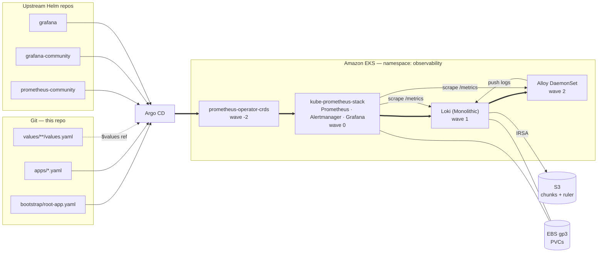

# Argo CD Observability — kube-prometheus-stack + Loki on EKS

> Deploy a full metrics-and-logs stack to EKS declaratively: Argo CD pulls two
> upstream Helm charts and your own values files from git, in the right order,
> with nothing applied by hand except a single bootstrap manifest.




## What you'll learn

- The **app-of-apps** pattern: one root Application that manages all the others
- **Multi-source Applications**: an upstream Helm chart + your git-hosted values
- **Sync waves** for ordering CRDs → operator → Loki → log shipper
- Why kube-prometheus-stack needs **ServerSideApply** and split-out CRDs
- The EKS-specific settings that stop four alerts firing forever on day one
- Loki on **S3 with IRSA** — no access keys in git

## Prerequisites

| Requirement | Note |
|---|---|
| EKS cluster, Kubernetes ≥ 1.25 | kube-prometheus-stack 90.x requires it |
| Argo CD ≥ 2.6 in namespace `argocd` | multi-source needs 2.6+ |
| EBS CSI driver add-on | for the Prometheus/Grafana/Loki PVCs |
| `eksctl`, `kubectl`, `aws` CLI | |
| A fork of this repo | you will edit values files and push |

---

## Step 1 — Fork and set your repo URL

Every `repoURL` pointing at git in `gitops/` must be **your** fork.

```bash
git clone https://github.com/<you>/aws-mini-lessons.git
cd aws-mini-lessons

grep -rl 'BoldFellow/aws-mini-lessons' argocd-observability/gitops \
  | xargs sed -i 's|BoldFellow/aws-mini-lessons|<you>/aws-mini-lessons|g'
```

If the repo is private, register it with Argo CD first:

```bash
argocd repo add https://github.com/<you>/aws-mini-lessons.git \
  --username <user> --password <PAT>
```

## Step 2 — Create a gp3 StorageClass

EKS ships `gp2` as default. `gp3` is ~20% cheaper and lets you buy IOPS
independently of size — always prefer it for Prometheus.

```bash
cat <<'EOF' | kubectl apply -f -
apiVersion: storage.k8s.io/v1
kind: StorageClass
metadata:
  name: gp3
  annotations:
    storageclass.kubernetes.io/is-default-class: "true"
provisioner: ebs.csi.aws.com
volumeBindingMode: WaitForFirstConsumer
allowVolumeExpansion: true
parameters:
  type: gp3
  encrypted: "true"
EOF

# Remove the default flag from gp2 so only one default exists
kubectl patch storageclass gp2 -p \
  '{"metadata":{"annotations":{"storageclass.kubernetes.io/is-default-class":"false"}}}'
```

## Step 3 — S3 buckets and the IAM role for Loki

Loki keeps its chunks and index in S3. Create the buckets:

```bash
export AWS_REGION=eu-central-1
export CLUSTER=my-eks-cluster
export ACCOUNT_ID=$(aws sts get-caller-identity --query Account --output text)
export BUCKET_PREFIX="${ACCOUNT_ID}-loki"

for b in chunks ruler; do
  aws s3api create-bucket --bucket "${BUCKET_PREFIX}-${b}" \
    --region "$AWS_REGION" \
    --create-bucket-configuration LocationConstraint="$AWS_REGION"
  aws s3api put-public-access-block --bucket "${BUCKET_PREFIX}-${b}" \
    --public-access-block-configuration \
    "BlockPublicAcls=true,IgnorePublicAcls=true,BlockPublicPolicy=true,RestrictPublicBuckets=true"
  aws s3api put-bucket-encryption --bucket "${BUCKET_PREFIX}-${b}" \
    --server-side-encryption-configuration \
    '{"Rules":[{"ApplyServerSideEncryptionByDefault":{"SSEAlgorithm":"AES256"}}]}'
done
```

Create the IAM policy (least privilege — only these two buckets):

```bash
cat > /tmp/loki-s3-policy.json <<EOF
{
  "Version": "2012-10-17",
  "Statement": [
    {
      "Sid": "LokiBucketAccess",
      "Effect": "Allow",
      "Action": ["s3:ListBucket", "s3:GetObject", "s3:PutObject", "s3:DeleteObject"],
      "Resource": [
        "arn:aws:s3:::${BUCKET_PREFIX}-chunks",
        "arn:aws:s3:::${BUCKET_PREFIX}-chunks/*",
        "arn:aws:s3:::${BUCKET_PREFIX}-ruler",
        "arn:aws:s3:::${BUCKET_PREFIX}-ruler/*"
      ]
    }
  ]
}
EOF

aws iam create-policy --policy-name LokiS3Access \
  --policy-document file:///tmp/loki-s3-policy.json
```

Bind it to the `loki` ServiceAccount with IRSA:

```bash
eksctl utils associate-iam-oidc-provider --cluster "$CLUSTER" --approve

eksctl create iamserviceaccount \
  --cluster "$CLUSTER" \
  --namespace observability \
  --name loki \
  --role-name loki-s3 \
  --attach-policy-arn "arn:aws:iam::${ACCOUNT_ID}:policy/LokiS3Access" \
  --role-only --approve
```

> `--role-only` matters: the Helm chart creates the ServiceAccount, `eksctl`
> only creates the role. If both create it, Argo CD will fight `eksctl` forever.

Now edit `gitops/values/loki/values.yaml` and replace every `CHANGEME`:

```yaml
loki:
  storage:
    bucketNames:
      chunks: <ACCOUNT_ID>-loki-chunks
      ruler:  <ACCOUNT_ID>-loki-ruler
    s3:
      region: eu-central-1

serviceAccount:
  annotations:
    eks.amazonaws.com/role-arn: arn:aws:iam::<ACCOUNT_ID>:role/loki-s3
```

> **EKS Pod Identity** is the newer alternative to IRSA — no OIDC provider, no
> annotation, and the trust policy is far simpler. If you use it, delete the
> `eks.amazonaws.com/role-arn` annotation and create a
> `PodIdentityAssociation` for `observability/loki` instead.

## Step 4 — Grafana admin credentials

Never commit these. Create the secret out of band:

```bash
kubectl create namespace observability --dry-run=client -o yaml | kubectl apply -f -

kubectl -n observability create secret generic grafana-admin \
  --from-literal=admin-user=admin \
  --from-literal=admin-password="$(openssl rand -base64 24)"
```

For real clusters, put it in AWS Secrets Manager and sync it in with the
External Secrets Operator — then even the secret's existence is declarative.

## Step 5 — Commit and bootstrap

```bash
git add argocd-observability && git commit -m "observability stack" && git push

kubectl apply -f argocd-observability/gitops/projects/observability.yaml
kubectl apply -f argocd-observability/gitops/bootstrap/root-app.yaml
```

That is the last imperative command in this lesson. Watch it converge:

```bash
kubectl -n argocd get applications -w
```

Expected order (this is sync waves doing their job):

```
prometheus-operator-crds   Synced   Healthy    # wave -2
kube-prometheus-stack      Synced   Healthy    # wave  0
loki                       Synced   Healthy    # wave  1
alloy                      Synced   Healthy    # wave  2
```

## Step 6 — Verify

```bash
# Grafana
kubectl -n observability port-forward svc/kube-prometheus-stack-grafana 3000:80
# -> http://localhost:3000, user admin, password from Step 4

# Are logs actually arriving?
kubectl -n observability logs -l app.kubernetes.io/name=alloy --tail=50 | grep -i loki

# Did anything land in S3?
aws s3 ls "s3://${BUCKET_PREFIX}-chunks/" --recursive | head
```

In Grafana → **Explore** → datasource **Loki**:

```logql
{namespace="observability"} |= "error"
```

And in **Explore** → datasource **Prometheus**:

```promql
sum by (namespace) (rate(container_cpu_usage_seconds_total{image!=""}[5m]))
```

## Step 7 — Prove GitOps works

Change something small and push:

```bash
sed -i 's/retention: 15d/retention: 30d/' \
  argocd-observability/gitops/values/kube-prometheus-stack/values.yaml
git commit -am "prometheus: retain 30d" && git push
```

Within the reconcile interval (3 min by default; `argocd app sync` to force it)
Argo CD re-renders the chart with the new values and rolls the StatefulSet.
No `helm upgrade`, no CI job with cluster credentials.

Now try the opposite — break it by hand:

```bash
kubectl -n observability scale deploy/kube-prometheus-stack-grafana --replicas=0
```

`selfHeal: true` puts it back within seconds. **The cluster cannot drift from
git.** That is the whole point.

---

## Design decisions worth defending in review

### CRDs are their own Application, in wave -2

The Prometheus CRDs are over 1 MB. Client-side apply writes a full copy into the
`kubectl.kubernetes.io/last-applied-configuration` annotation and hits the
262144-byte limit — the classic `metadata.annotations: Too long` failure.
`ServerSideApply=true` removes that annotation from the picture entirely.

Splitting them out also fixes a Helm limitation: charts do not upgrade CRDs in
their `crds/` directory. As a separate chart, a CRD bump is an ordinary sync.
`crds.enabled: false` in the stack's values prevents double ownership, and
`prune: false` on the CRD app means a mis-sync can never cascade-delete every
`ServiceMonitor` in the cluster.

### Four EKS components are disabled

`kubeControllerManager`, `kubeScheduler`, `kubeEtcd` and `kubeProxy` all default
to enabled and all assume a self-managed control plane. On EKS those endpoints
do not exist, so you get four permanently-firing `TargetDown` alerts and the
matching `defaultRules` groups alert on data that will never arrive. Turning off
both the exporters *and* their rule groups is the fix.

(`kubeProxy` is recoverable: patch the `kube-proxy` ConfigMap to
`metricsBindAddress: 0.0.0.0:10249` and re-enable it.)

### `serviceMonitorSelectorNilUsesHelmValues: false`

Default behaviour is that Prometheus only discovers `ServiceMonitor`s carrying
this Helm release's labels — so Loki's and Alloy's are invisible. This one line
is why "I installed the stack and my app's ServiceMonitor does nothing" is the
most-asked kube-prometheus-stack question.

### `ignoreDifferences` on the admission webhooks

The operator injects a CA bundle into its webhook configurations at runtime.
Argo CD sees a field it did not put there and reports `OutOfSync`; `selfHeal`
strips it; the operator re-adds it. Without `ignoreDifferences` you get an
infinite sync loop. `RespectIgnoreDifferences=true` is required for those
exclusions to also apply under server-side apply.

### Loki: Monolithic, but on S3

| Mode | Throughput | Object storage |
|---|---|---|
| Monolithic (was `SingleBinary`) | up to tens of GB/day | optional, use it anyway |
| SimpleScalable | up to ~1 TB/day | required — *removed in Loki 4* |
| Distributed | > 1 TB/day | required |

Start Monolithic, but back it with S3 from the first day: chunks then survive
the pod, and moving to Distributed later is a values change rather than a
migration. Filesystem storage is for `helm template` experiments only.

Two settings people forget:

- `loki.schemaConfig` is empty by default and a real install **requires** it.
  Use `tsdb` + `v13`. Never edit an existing schema entry — append a new one
  with a future `from` date.
- `retention_period` in `limits_config` does nothing unless the compactor is
  told to enforce it (`compactor.retention_enabled: true`). Otherwise your S3
  bill grows forever while Grafana politely hides the old data.

The chart's memcached caches (`chunksCache`, `resultsCache`) default to on and
request several GB each. Correct at scale, but on a lab cluster they simply
never schedule — hence disabled here.

### Alloy, not Promtail

Promtail reached **end-of-life on 2 March 2026**. Grafana Alloy is the
supported replacement; `alloy convert --source-format=promtail` migrates an
existing config. The deprecated `loki-stack` chart (2.10.3) bundles Promtail —
avoid it for anything new.

Keep the Loki label set small. Every distinct label-value combination is a
separate stream; `pod` is already borderline and `pod_uid` or `trace_id` as a
label will make queries unusable. Put high-cardinality data in the log line and
filter it with LogQL.

### Chart source has moved (March 2026)

The OSS Loki Helm chart moved from `grafana/helm-charts` to
`grafana-community/helm-charts` (forked at 6.55.0, versioned independently from
there). The chart still published at `grafana.github.io/helm-charts` is now
maintained for Grafana Enterprise Logs. This lesson uses the community chart.

## Versions pinned in this lesson

| Chart | Repo | Version | App version |
|---|---|---|---|
| `prometheus-operator-crds` | prometheus-community | 31.0.1 | — |
| `kube-prometheus-stack` | prometheus-community | 90.0.0 | operator v0.93.1 |
| `loki` | grafana-community | 18.12.1 | Loki 3.7.7 |
| `alloy` | grafana | 1.12.1 | Alloy v1.19.2 |

Always pin `targetRevision` to an exact version. `targetRevision: "*"` or a
range makes your cluster's contents depend on when it last reconciled, which is
the opposite of GitOps.

## Cleanup

```bash
kubectl -n argocd delete application observability-root   # cascades via finalizer
kubectl delete namespace observability
aws s3 rb "s3://${BUCKET_PREFIX}-chunks" --force
aws s3 rb "s3://${BUCKET_PREFIX}-ruler"  --force
eksctl delete iamserviceaccount --cluster "$CLUSTER" --namespace observability --name loki
aws iam delete-policy --policy-arn "arn:aws:iam::${ACCOUNT_ID}:policy/LokiS3Access"
```

## Reference

- [Argo CD — multiple sources for an Application](https://argo-cd.readthedocs.io/en/stable/user-guide/multiple_sources/)
- [Argo CD — Helm value precedence](https://argo-cd.readthedocs.io/en/stable/user-guide/helm/)
- [Argo CD — app-of-apps / cluster bootstrapping](https://argo-cd.readthedocs.io/en/stable/operator-manual/cluster-bootstrapping/)
- [kube-prometheus-stack chart](https://github.com/prometheus-community/helm-charts/tree/main/charts/kube-prometheus-stack)
- [Loki deployment modes](https://grafana.com/docs/loki/latest/get-started/deployment-modes/)
- [Migrate from Promtail to Alloy](https://grafana.com/docs/loki/latest/setup/migrate/migrate-to-alloy/)
- [IAM roles for service accounts (IRSA)](https://docs.aws.amazon.com/eks/latest/userguide/iam-roles-for-service-accounts.html)
