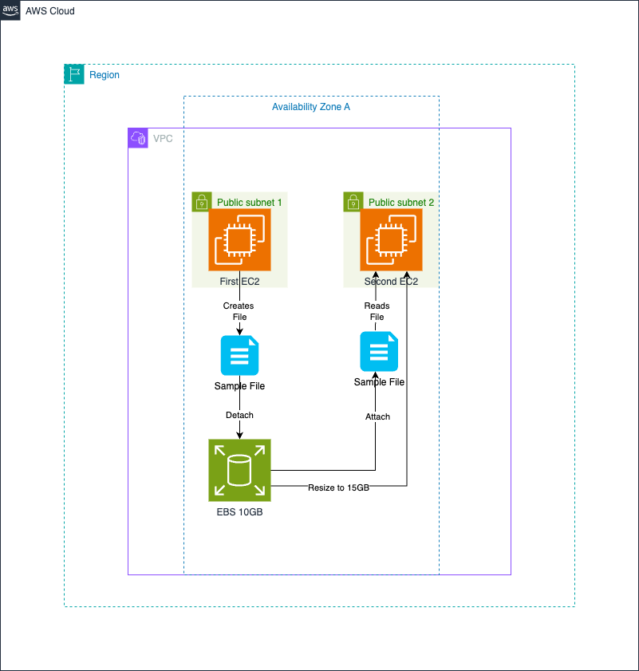

# EBS — Elastic Block Store



> Demonstrate that EBS is a block device attached to one EC2 instance at a time: write a file on VM1, detach the volume, attach it to VM2, and read the same file.

## What you'll learn

- EBS volumes are network-attached block devices (like a USB drive over the network)
- An EBS volume can only be attached to **one** EC2 instance at a time
- Data persists independently of the EC2 instance lifecycle
- How to format, mount, resize, and move an EBS volume

## Lab steps

### On VM1 (first EC2 instance)

```bash
# Verify the volume is attached
lsblk

# Format the volume (do this only once — not on re-attach)
sudo mkfs.ext4 /dev/sdb

# Create mount point and mount
sudo mkdir /mnt/ebs
sudo mount /dev/sdb /mnt/ebs

# Confirm mount
df -h

# Set permissions and write a test file
sudo chmod -R 777 /mnt/ebs
echo "Testing EBS" > /mnt/ebs/testfile.txt

# Unmount before detaching
sudo umount /mnt/ebs
```

> **Detach the EBS volume from VM1 in the EC2 console before proceeding.**

### On VM2 (second EC2 instance)

```bash
# Verify the volume is attached
lsblk

# Create mount point and mount (do NOT reformat — that would erase the data)
sudo mkdir /mount/ebs
sudo mount /dev/xvdb /mount/ebs

# Confirm mount
df -h

# Verify the file written on VM1 is present
ls /mount/ebs
# → testfile.txt
```

### Resize the volume (10 GB → 15 GB)

1. In the EC2 console, modify the volume size from 10 GB to 15 GB
2. On the instance, extend the filesystem to use the new space:
   ```bash
   sudo resize2fs /dev/xvdb
   ```
3. Verify: `df -h` should now show 15 GB

## Key concepts

| Concept | Detail |
|---|---|
| Block device | EBS presents as a raw block device — you choose the filesystem |
| Persistence | Data survives instance stop/terminate (unlike instance store) |
| Attachment scope | One volume → one instance at a time (not shared) |
| AZ-bound | EBS volumes live in one AZ; you cannot attach across AZs |
| Snapshots | Take a snapshot to copy a volume to another AZ or region |
