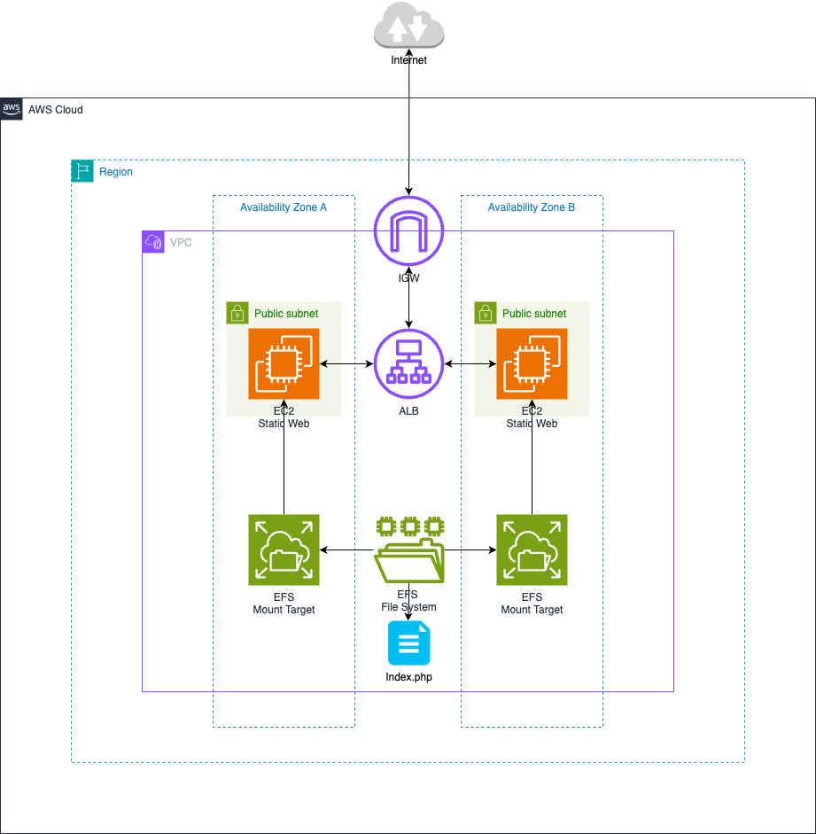

# EFS — Elastic File System



> Demonstrate shared storage: mount the same EFS filesystem on two EC2 instances simultaneously and serve an Apache website whose files live on EFS — both instances read and write the same files.

## What you'll learn

- EFS is a managed NFS filesystem that multiple EC2 instances can mount at the same time
- Unlike EBS, EFS is regional (not AZ-bound) and scales automatically
- How to configure Apache to serve from an EFS-backed directory
- The difference between EBS (one instance, block) and EFS (many instances, file)

## Lab steps

Run these steps on **each** EC2 instance unless noted otherwise.

### 1. Install Apache, EFS utilities, and PHP

```bash
sudo yum install -y httpd amazon-efs-utils php
```

### 2. Create the EFS mount point

```bash
sudo mkdir -p /mnt/efs
```

### 3. Mount the EFS filesystem

```bash
# Replace <File-System-ID> with your EFS ID (e.g. fs-0123456789abcdef0)
sudo mount -t efs -o tls,rw <File-System-ID>:/ /mnt/efs
```

### 4. Set up the web directory on EFS

```bash
sudo mkdir -p /mnt/efs/www/html

# Remove Apache's default local web directory
sudo rm -rf /var/www/html

# Symlink Apache's expected path to the EFS directory
sudo ln -s /mnt/efs/www/html /var/www

# Set ownership so Apache can read/write
sudo chown -R apache:apache /mnt/efs/www
sudo chmod -R 755 /mnt/efs/www
```

### 5. Create a test page (run once — both instances see it immediately)

```bash
sudo su
sudo tee /mnt/efs/www/html/index.php << 'EOF'
<!DOCTYPE html>
<html>
<head><title>EFS Web Server Test</title></head>
<body>
  <h1>Hello World from EFS</h1>
  <p>Server: <?php echo gethostname(); ?></p>
  <p>Time: <?php echo date('Y-m-d H:i:s'); ?></p>
</body>
</html>
EOF
```

### 6. Start Apache

```bash
sudo systemctl start httpd
```

Visit the public IP of each instance — both serve the **same** `index.php` from EFS. The `gethostname()` line shows which instance handled the request.

## Key concepts

| Concept | Detail |
|---|---|
| Shared access | Many instances mount the same filesystem simultaneously |
| Regional scope | EFS spans all AZs in a region (vs. EBS which is AZ-bound) |
| Auto-scaling storage | No pre-provisioning — pay for what you use |
| NFS protocol | Standard NFS — `amazon-efs-utils` adds TLS and IAM auth |
| Use case | Shared config, shared content, home directories across instances |
