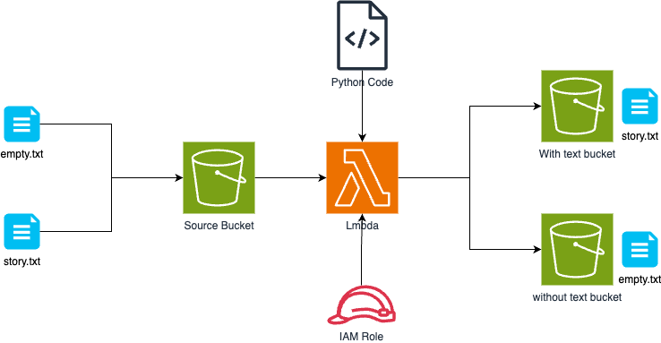

# Filtering Lambda — S3 Event-Driven File Routing



> Trigger a Lambda function when a file lands in S3, inspect its content, and route it to one of two target buckets based on whether it is empty or not.

## What you'll learn

- S3 event notifications as a Lambda trigger
- Reading an S3 object from within a Lambda function
- Environment variables for runtime configuration
- S3 `copy_object` + `delete_object` as an atomic move pattern
- IAM permissions required for S3-triggered Lambda

## Architecture

```
Source S3 bucket
  └── PUT event → Lambda function
                    ├── empty file  → Target Bucket 1
                    └── non-empty   → Target Bucket 2
```

## Setup steps

1. **Create three S3 buckets:** source, target-empty, target-nonempty
2. **Create the Lambda function** using `lambda_function.py` with runtime Python 3.12
3. **Set environment variables** on the Lambda function:
   - `TARGET_BUCKET_1` — name of the empty-file bucket
   - `TARGET_BUCKET_2` — name of the non-empty-file bucket
4. **Attach an IAM policy** granting the Lambda role:
   - `s3:GetObject` + `s3:DeleteObject` on the source bucket
   - `s3:PutObject` on both target buckets
5. **Add an S3 trigger** on the source bucket: event type `s3:ObjectCreated:*`
6. **Test:** upload an empty file and a non-empty file; verify each lands in the correct target bucket

## Lambda function

See [`lambda_function.py`](lambda_function.py).

The logic is intentionally minimal — the interesting parts are the IAM setup and the S3 event schema.

## Key concepts

| Concept | Detail |
|---|---|
| S3 event notification | PUT/POST/COPY triggers Lambda synchronously |
| Event schema | `event['Records'][0]['s3']['bucket']['name']` and `['object']['key']` |
| Move pattern | S3 has no native move — copy + delete is the standard approach |
| Environment variables | Decouple bucket names from code; change without redeploying |
| IAM least privilege | Lambda role needs explicit permissions on source AND both targets |
