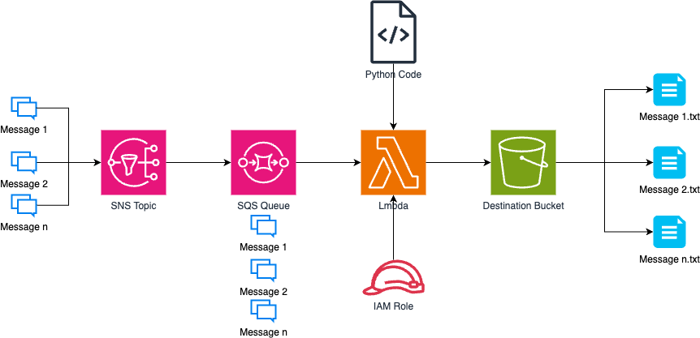

# SNS + SQS + Lambda + S3 — Message Filtering Fan-out



> Configure an SNS topic with two SQS subscribers, each filtered to receive only messages matching a specific prefix. Then add a Lambda that publishes confirmed messages to S3.

## What you'll learn

- SNS fan-out: one publish reaches multiple subscribers
- SNS filter policies: route messages by attribute prefix
- SQS as a durable buffer between SNS and downstream consumers
- Lambda triggered by SQS events
- How to test message routing without writing application code

## Architecture

### Variant 1 — SNS + Lambda + S3

```
Publisher → SNS Topic → Lambda → S3 bucket
```

See `sns-lambda.py` for the Lambda code and `sns-lambda.png` for the diagram.

### Variant 2 — SNS + SQS filter fan-out

```
Publisher → SNS Topic ─┬─ (filter: bold-)  → BoldQueue
                        └─ (filter: hairy-) → HairyQueue
```

See `sns-sqs-lambda-s3.png` for the diagram.

## Lab steps

### Step 1 — Create an SNS topic

> **Console:** SNS → Topics → Create topic → Standard → name: `FilteredTopic`

### Step 2 — Create two SQS queues

- `BoldQueue` — Standard queue
- `HairyQueue` — Standard queue

### Step 3 — Subscribe both queues to the SNS topic

For each queue: SNS → FilteredTopic → Subscriptions → Create subscription → Protocol: SQS → Endpoint: queue ARN

### Step 4 — Add filter policies

**BoldQueue subscription → Edit → Filter policy:**
```json
{
  "FilterKey": [{ "prefix": "bold-" }]
}
```

**HairyQueue subscription → Edit → Filter policy:**
```json
{
  "FilterKey": [{ "prefix": "hairy-" }]
}
```

### Step 5 — Test with the AWS CLI

```bash
# This message should arrive in BoldQueue only
aws sns publish \
  --topic-arn arn:aws:sns:us-east-1:123456789012:FilteredTopic \
  --message "This is a bold message." \
  --message-attributes '{"FilterKey":{"DataType":"String","StringValue":"bold-test"}}'

# This message should arrive in HairyQueue only
aws sns publish \
  --topic-arn arn:aws:sns:us-east-1:123456789012:FilteredTopic \
  --message "This is another message." \
  --message-attributes '{"FilterKey":{"DataType":"String","StringValue":"hairy-test"}}'
```

### Step 6 — Verify

SQS → BoldQueue → Send and receive messages → Poll for messages (should see the bold message only)
SQS → HairyQueue → same (should see the hairy message only)

## Files

| File | Purpose |
|---|---|
| `sns-lambda.png` / `sns-lambda.drawio` | Diagram — SNS + Lambda + S3 variant |
| `sns-sqs-lambda-s3.png` / `sns-sqs-lambda-s3.drawio` | Diagram — SNS + SQS filter fan-out |
| `sns-lambda.py` | Lambda function — receives SNS notification, writes subject to S3 |
| `sqs-sns-lambda.py` | Lambda function — SQS-triggered, processes filtered messages |

## Key concepts

| Concept | Detail |
|---|---|
| Fan-out | One SNS publish delivers to all subscriptions simultaneously |
| Filter policy | SNS evaluates message attributes; non-matching subscribers never receive the message |
| Prefix filter | `{"prefix": "bold-"}` matches any attribute value starting with `bold-` |
| SQS buffer | Queue decouples producer from consumer; messages survive consumer downtime |
| Dead-letter queue | Add a DLQ to SQS for messages that fail processing after N retries |
